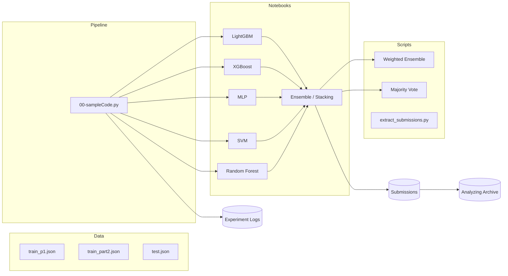

# **📘 Embedded Echoes Challenge – DSS Kaggle ML Competition**

**Predicting “importance” using corrupted image + text embeddings**

[](https://www.kaggle.com/competitions/dss-comp/)


---

# **1. Introduction**

This repository contains all experimentation, models, logs, and submissions created for the Kaggle competition:

🔗 **Embedded Echoes Challenge – DSS ML Competition**
[https://www.kaggle.com/competitions/dss-comp/](https://www.kaggle.com/competitions/dss-comp/)

The competition presents a unique scenario:
A catastrophic system failure destroyed all images and text. Only **512-dim image embeddings** and **512-dim text embeddings** survived.

Your task is to build ML models that classify whether a sample is:

* **1 → Important**
* **0 → Not Important**

Evaluation metric: **Macro F1 Score**

This repository is a **fully reproducible ML experimentation workspace**, including:

* Clean, reusable pipeline (`00-sampleCode.py`)
* Classical ML models (XGBoost, LightGBM, SVM, RF, Logistic Regression)
* Neural baselines (MLP)
* Hyperparameter searches
* Ensembling & stacking
* Detailed experiment logs
* Automated submission archiving
* Full Git commit → submission traceability

---

# **2. Repository Structure**

✔ This is autogenerated from the project directory tree: 

```
repo/
│
├── 00-sampleCode.py                   # Base pipeline: preprocessing, CV, logging, submission
│
├── *.ipynb                            # One notebook per model family
│   ├── 01-lightgbm.ipynb
│   ├── 02-xgboost.ipynb
│   ├── 03-mlp.ipynb
│   ├── 05-linearSVM.ipynb
│   ├── 09-catboost.ipynb
│   └── 12-ensemble.ipynb
│
├── data/
│   ├── train_p1.json
│   ├── train_part2.json
│   ├── test.json
│   └── sample_solution.csv
│
├── logs/                              # Automated experiment logs
│   ├── experiments_log_Zuha.csv
│   ├── experiments_log_Maryam.csv
│   ├── experiments_log_Maham.csv
│   └── model-specific logs...
│
├── submissions/                       # Curated submission CSVs
│   ├── XGB/*.csv
│   ├── SVM_Zuha/*.csv
│   └── other submissions...
│
├── analyzing/                         # Commit-by-commit archival
│   ├── submissions_metadata.csv
│   └── versioned submissions...
│
├── extract_submissions.py
├── make_weighted_submission.py
├── make_majority_submission.py
├── automl-pycaret.py
│
├── structure.txt
└── DSS Kaggle ML Competition Manual.pdf
```

---

# **3. Architecture Overview**

## **3.1 End-to-End Pipeline**

```mermaid
flowchart TD

A[Raw Data\n(JSON embeddings)] --> B[00-sampleCode.py\nData Loading & Preprocessing]
B --> C[Cross Validation]
C --> D[Model Training\n(XGB, SVM, LGBM, MLP, etc.)]
D --> E[Generate Submission CSV]
D --> F[Experiment Logging\n(logs/)]
E --> G[Final Submissions\n(submissions/)]
G --> H[Archived Analysis\n(analyzing/)]
```

---

## **3.2 Repository Map**



---

# **4. Getting Started**

## **4.1 Clone the Repository**

```bash
git clone <your_repo_link>
cd <your_repo_name>
```

---

# **5. Python Environment Setup**

## **5.1 Create a Virtual Environment**

### On Windows

```bash
py -m venv .venv
.\.venv\Scripts\activate
```

### On macOS / Linux

```bash
python3 -m venv .venv
source .venv/bin/activate
```

Exit environment:

```bash
deactivate
```

---

## **5.2 Install Dependencies**

Your `requirements.txt` should contain:

```
numpy
pandas
scikit-learn
xgboost
lightgbm
catboost
pycaret
matplotlib
jupyter
```

Install:

```bash
pip install -r requirements.txt
```

---

## **5.3 Running Notebooks**

### Jupyter

```bash
jupyter notebook
```

### VS Code

* Install “Python” + “Jupyter” extensions
* Select `.venv` interpreter
* Run notebook cells

---

# **6. Core File: `00-sampleCode.py`**

This file provides the **standardized experiment pipeline**, including:

✔ Data loading
✔ Feature building (image/text/both)
✔ Imputation + Scaling + PCA
✔ Stratified K-Fold or K-Fold
✔ Cross-validation loop
✔ Final model training
✔ Submission generation
✔ Unified logging (`logs/`)

All other model files simply:

```
define build_model_fn()
load data
preprocess data
run_cv_and_fit_full()
save submission
log results
```

---

# **7. Adding a New Model**

Example (Logistic Regression):

```python
def build_logreg():
    return LogisticRegression(
        penalty="l2",
        C=1.0,
        solver="liblinear",
        max_iter=5000,
        class_weight="balanced"
    )
```

Run training:

```python
results = run_cv_and_fit_full(
    build_model_fn=build_logreg,
    X=X_train_proc,
    y=y_train,
    X_test=X_test_proc,
    config=CONFIG,
    model_name="LogReg"
)
```

Save submission:

```python
path = save_submission(test_ids, results["test_pred"], CONFIG, "logreg_v1")
```

---

# **8. Hyperparameter Tuning**

## **8.1 CONFIG-level tuning**

Examples:

```python
CONFIG["SCALER_TYPE"] = "standard"
CONFIG["USE_PCA"] = True
CONFIG["PCA_N_COMPONENTS"] = 256
CONFIG["IMBALANCE_MODE"] = "scale_pos_weight"
CONFIG["N_FOLDS"] = 5
```

## **8.2 Parameter grid search**

Example:

```python
for depth in [4,6,8]:
    for lr in [0.05, 0.03]:
        params = {"n_estimators":800, "max_depth":depth, "learning_rate":lr}
```

---

# **9. Ensembling & Stacking**

### Majority Voting

```bash
python make_majority_submission.py
```

### Weighted Voting

Edit inside the script:

```python
weights = {
    "xgb.csv": 0.5,
    "svm.csv": 0.3,
    "mlp.csv": 0.2
}
```

### Stacking

See:

* `12-ensemble.ipynb`
* `13-stacking.ipynb`
* `14-logreg_linearSVM-ensemble.ipynb`

---

# **10. Experiment Tracking**

### `logs/`

Contains structured experiment logs per contributor.

### `analyzing/`

Generated using:

```bash
python extract_submissions.py
```

This includes:

* Every version of every submission
* Commit hash
* Commit message
* Timestamp
* Score inferred from filename

This allows **full reproducibility of the entire project**.

---

# **11. Understanding Results**

Examples of top submissions:

* `ensemble_Zuha_Ensemble_XGB_AdaBoost__...__0_7593.csv`
* `random_Zuha__...__0_7448.csv`

Score format:
`__0_7593` → **0.7593 Macro F1**

See:

```
analyzing/submissions_metadata.csv
```

---

# **12. Contributors**

### **Zuha Aqib**

* Complete pipeline design (`00-sampleCode.py`)
* SVM (Linear & RBF), XGBoost, RF, AdaBoost, and ensemble experiments
* Weighted voting & majority vote scripts
* Submission generation automation
* Extraction of historical submissions
* Most high-score submissions (0.74–0.7593 range)

### **Maham Junaid**

* Led **MLP experiments**, tuning hidden layers & nonlinear features
* Added stacking variants with MLP + XGB + LGBM
* Performed multiple ensemble fusion tests
* Logged structured model-specific experiments

### **Maryam Ihsan**

* Contributed **RBF-SVM**, classical baselines, and parameter sweeps
* Logged multiple mid-level experiments
* Helped with archival & structured commits
* Assisted in refining SVM grid searches

Together, the team built a **complete, reproducible, multi-model ML framework** for the Embedded Echoes Challenge.

---

# **13. Citation**

**Embedded Echoes Challenge – DSS ML Competition**
[https://www.kaggle.com/competitions/dss-comp/](https://www.kaggle.com/competitions/dss-comp/)